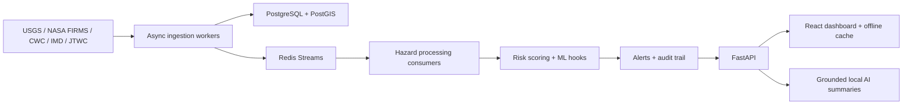

# ALERTIX Technical Architecture

ALERTIX is an async FastAPI, Redis Streams, PostGIS, and React system for multi-hazard monitoring across India.

## Data Flow

## Processing State Machine

`NEW -> PROCESSING -> VALIDATED -> ROUTED -> ALERTED -> STORED`

Validation failures enter the DLQ. Processing failures enter retry with exponential backoff.

## ML Modules

- `aftershock_omori.py`: Omori-Utsu statistical aftershock probability only.
- `flood_lstm.py`: PyTorch LSTM for 24h/48h/72h river-level forecasting.
- `flood_unet.py`: U-Net flood extent segmentation.
- `damage_segment.py`: classifier plus mask head for citizen imagery.
- `wildfire_cluster.py`: DBSCAN hotspot clustering.
- `cyclone_track.py`: track extrapolation from observed positions.
- `geolocation.py`: PostGIS resolver with static river fallback.

Learned models must load real checkpoint weights before inference.

## AI Guardrails

The `/ai/*` endpoints retrieve recent events and citizen reports, then ask the LLM for grounded summaries only. Outputs are labelled AI-generated and not official alerts. The LLM cannot emit alerts or make exact earthquake predictions.
